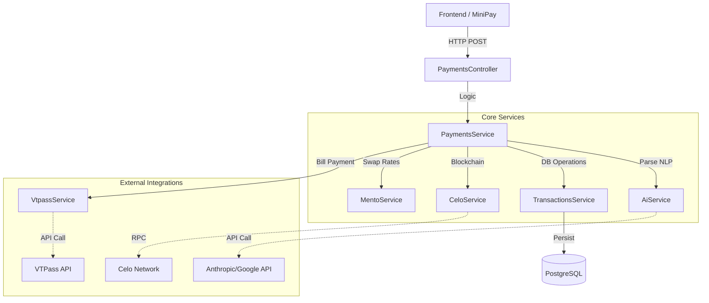
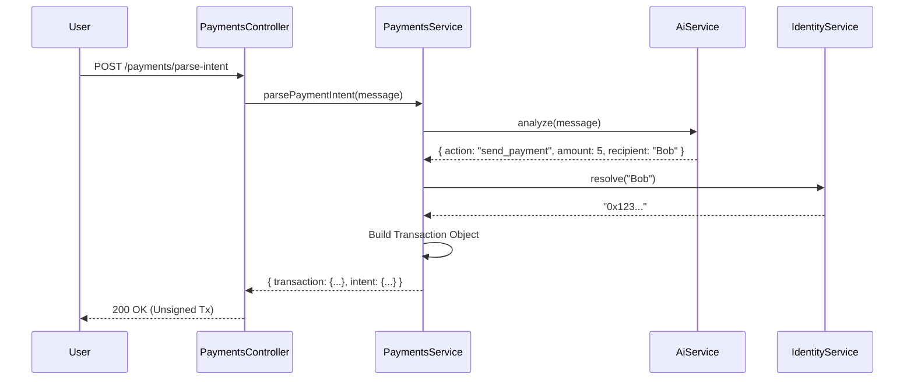
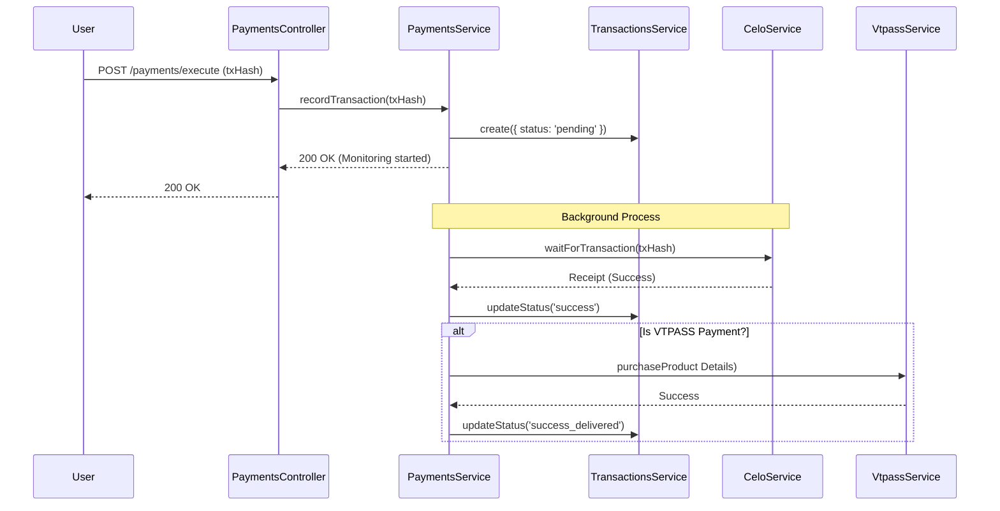

# RonPay Backend Testing Guide

This document outlines the architecture and testing strategies for the RonPay backend, specifically focusing on the payment flows and external integrations.

## Architecture Overview

The backend is built with NestJS and uses a modular architecture.



## Payment Flows

### 1. Parse Payment Intent (Natural Language)

This flow converts a user's natural language request (e.g., "Send 5 cUSD to Bob") into a structured transaction object that can be signed by the wallet.

**Testing Focus:**
- **Unit Tests**: Mock `AiService` to return specific intents. Verify `PaymentsService` correctly constructs the transaction object.
- **Scenarios**:
  - Valid transfer request.
  - Invalid recipient (mock `IdentityService`).
  - Unsupported action.



### 2. Execute Payment

After the user signs the transaction on the frontend/wallet, this endpoint records it.

**Testing Focus:**
- **transactions execution**: Verify `TransactionsService.create` is called with "pending".
- **VTPASS Trigger**: Verify that if the transaction is to the *RonPay Treasury* and has VTPASS metadata, the `VtpassService.purchaseProduct` is triggered AFTER confirmation.
- **Failures**: Mock `CeloService.waitForTransaction` to fail or return a revert status.



## Testing Strategy

### Unit Testing (Jest)
Run unit tests to verify individual services logic in isolation.
```bash
pnpm test
```
*Tip: Mock external services like `CeloService` and `AiService` to avoid real API calls and gas costs.*

### Integration Testing
Test the interaction between Controller, Service, and Database.
```bash
pnpm test:e2e
```
*Requires a running database instance (e.g., Docker).*

### Key Test Cases to Implement

1.  **`payments.service.spec.ts`**:
    - **`should parse simple transfer intent`**: Mock AI response -> Expect valid transaction object.
    - **`should reject invalid address`**: Mock AI response with bad address -> Expect BadRequestException.
    - **`should trigger vtpass on treasury payment`**:
        - spyOn sent `vtpassService.purchaseProduct`.
        - call `recordTransaction` with treasury address.
        - mock `waitForTransaction` to resolve immediately with success.
        - Expect spy to be called.

2.  **`vtpass.service.spec.ts`**:
    - **`should call VTPass API with correct params`**: Mock `axios` or HTTP request -> Expect correct payload.
